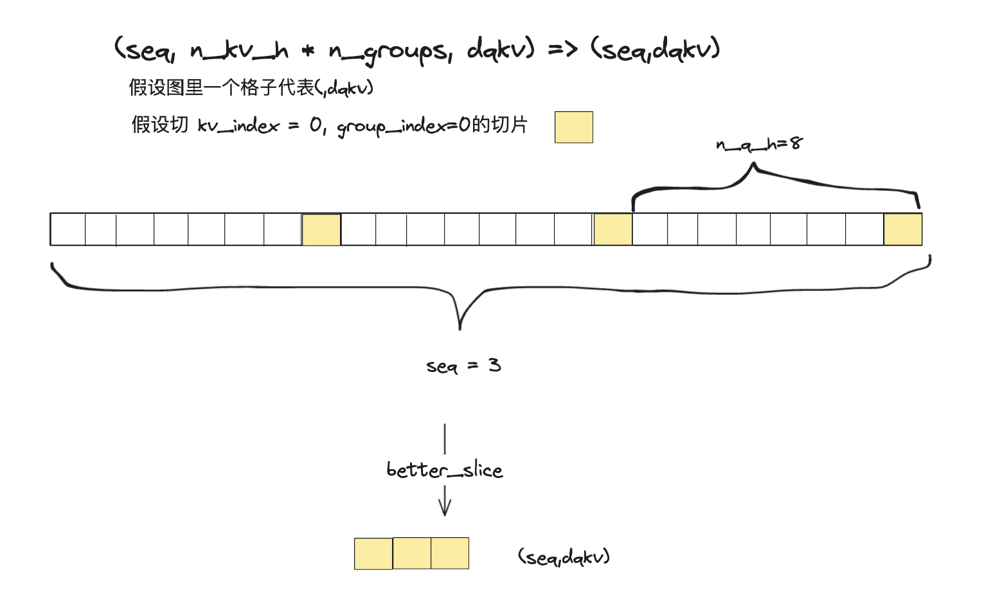
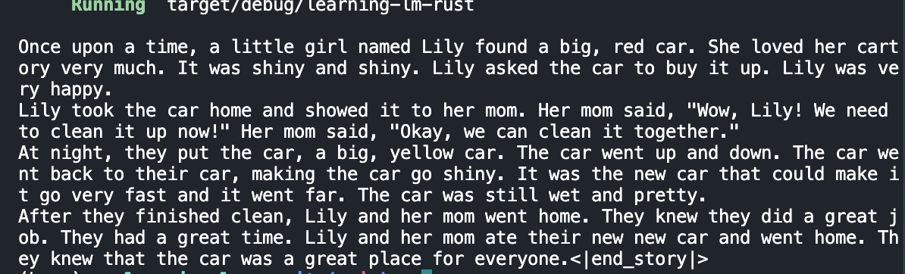

## 简单大模型推理系统

在这个实验里，我们实现了一个简单的大模型推理系统，这是我的[代码仓库](https://github.com/scatyf3/learning-lm-rs)

### step0 operators

第零步，即阶段二中的内容是实现算子，实现内容在`src/operator.rs`中，但是对于self attention，或许需要在算子的实现中额外注意：

- 矩阵乘需要先将c(output)置0，否则导致计算错误
    - 这个微妙的错误在简单的testcase中没有发现，因为它用的都是简单的tensor，而没考虑复用缓冲区的问题
- `attn_score * v`是不带转置的矩阵乘，需要额外实现一个
    - 比较好奇，实现转置算子和用原始的`matmul_transb`好呢，还是写一个新的非转置矩阵乘好呢🤔
    - 理论上`matmul_transb`对访存更友好，因为两个矩阵的访存模式一致，但转置也会带来更大的开销

```rs
    for x in 0..x_num{
        for y in 0..y_num{
            _c[x*y_num+y] = 0.0; //⚠️这一行害我debug好久，当然有可能是我菜orzzz
            for k in 0..k_num{
                _c[x*y_num+y]+=_a[x*k_num+k]*_b[k*y_num+y];
            }
        }
    }
```

### step1 self-attention

接着，根据课程所学，实现自注意力模块，其一共有五个操作:

```py
score = Q @ K.T / sqrt(dim)
attn = softmax(score)
x = attn @ V
```

我选择的路线是「将这些矩阵视为多个向量，并按照正确的对应关系手动进行索引和向量乘法」而非在`matmul_transb`中进行广播，故这里的代码可能略复杂，其基本内容如注释所写，首先获得q，k的正确切片，然后进行矩阵乘，并且除以$\sqrt{d}$，然后将这个“注意力切片”写回最终的注意力（这很不优雅，或许可以修改）


```rs
let mut attn = Tensor::<f32>::default(&vec![seq_len,total_seq_len]);
    for i in 0..n_kv_h {
        //get slice of k
        let slices_k: Vec<(usize, usize)> = vec![(0, total_seq_len), (i*dqkv, (i+1)*dqkv)]; //(0,0咋办)
        let cur_k = k.better_slice(&slices_k);
        for j in 0..n_groups{
            // (seq, n_kv_h * n_groups, dqkv) => (seq,dqkv)
            let slices_q: Vec<(usize, usize)> = vec![(0, seq_len), (i*n_groups+j,i*n_groups+(j+1)) ,(0,dqkv)]; 
            let mut cur_q = q.better_slice(&slices_q);
            cur_q.reshape(&vec![seq_len,dqkv]);
            OP::matmul_transb(&mut attn, 0.0, &cur_q, &cur_k, 1.0);
            let att_scores_data = unsafe{ att_scores.data_mut()};
            let attn_data = unsafe { attn.data_mut() };
            //TODO: intrinsics
            for k in 0..(seq_len*total_seq_len){
                attn_data[k] = attn_data[k] / (dqkv as f32).sqrt();
            }

            let att_scores_index = i * n_groups * seq_len * total_seq_len + j * seq_len * total_seq_len;
            for m in 0..seq_len{
                for n in 0..total_seq_len{
                    //将(seq_len, total_seq_len)的切片attn_data写回(n_kv_h, n_groups, seq, total_seq)的attn_score
                    let attn_data_index =  m * total_seq_len + n;
                    att_scores_data[att_scores_index+attn_data_index] = attn_data[attn_data_index];
                }
            }

        }
    }
```

其中，值得指出的是，对q的切片比较特殊，它无法用Tensor中`slice()`方法完成，因为它的切片不是连贯的，所以我们仿照pytorch，对Tensor增加了`better_slice`这个方法




同理，对attn_score * v ，也进行类似操作，然后得到输出的`hidden_state`


### step2 forward

在forward里，我们需要完成attention计算后的两步操作

```python
x = x @ O_weight.T
residual = x + residual
MLP()
```

这里直接调用一步`matmul_transb`即可

```rs
OP::matmul_transb(&mut residual, 1.0 , &hidden_states, &self.params.wo[layer], 1.0);
```

接着调用MLP，也是按照我们的实现调用相应的参数即可

```rs
mlp(&mut residual , &mut hidden_states,&mut gate_buf,&mut up_buf,&self.params.w_up[layer],&self.params.w_down[layer],&self.params.w_gate[layer],&self.params.rms_ffn_w[layer],self.eps);
```

### step3 generate

这一步也很简单，只要想明白forward中tensor的输入和输出即可，简而言之，generate分为两个阶段：
- prefill: 将prompt装入一个tensor，然后forward一次即可
- generate: 用prefill生成的“第一个token”包装成一个tensor，然后进行forward，以此类推，每次循环输入一个单token tensor
- 用一个额外的`vec<u32>`记录结果，最后返回

```rs
pub fn generate(
    &self,
    token_ids: &[u32],
    max_len: usize,
    top_p: f32,
    top_k: u32,
    temperature: f32,
) -> Vec<u32>{
    let mut result = Vec::<u32>::new();
    let mut cache = self.new_cache();
    //prefill
    let prompt = Tensor::<u32>::new(token_ids.to_vec(), &vec![max_len]);
    let first_logit=self.forward(&prompt, &mut cache);
    let first_token = OP::random_sample(&first_logit, top_p, top_k, temperature);

    //generate
    result.push(first_token);
    let mut result_tensor = Tensor::<u32>::new(vec![first_token], &vec![1]);
    for _ in prompt.size()..self.max_seq_len { 
        let logit = self.forward(&result_tensor, &mut cache);
        let cur_token = OP::random_sample(&logit, top_p, top_k, temperature);
        if cur_token == self.eos_token_id {
            break;
        }
        result_tensor = Tensor::<u32>::new(vec![cur_token], &vec![1]);
        result.push(cur_token);
    }
    result
}
```


### extra: debug方法

在prefill阶段，理论上如果prompt一样的话，每一层的结果都是固定的，所以可以用transformer库加载模型，然后逐层对比tensor的数值以确定程序写的是否正确。我的prefill阶段正确结果在`data/`文件夹下，我开发`self_attention`时带打印中间结果的代码在[self_attn_dev](https://github.com/scatyf3/learning-lm-rs/tree/self_attn_dev)分支中


### 运行结果


